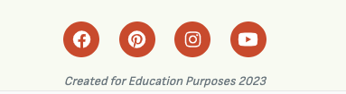

<h1 align=center>Wholebeans!!</h1>

<h2 align=center>Introduction</h2>

Wholebeans is a website for coffee lovers dedicated to sharing, creating and interacting with coffee recipes and baristas from all around the world. Whether you are just getting into coffee or are a professional barista, wholebeans is the one stop place for all coffee related recipes.   
Browse through loads of different coffee recipes and even add your own! You can also comment and like other recipes to show your support. This website if perfect for anyone who is trying coffee from a new roaster or origin and is not sure how to diall it in for the perfect cup of coffee. Fear not, simply use the search bar to find a similar recipe for the coffee/wholebean you plan to use.    Users can now search through different recipes that have already been added to the site and registered users can create, update, edit and delete recipes from the website and via the admin panel.    Wholebeans has been buiot using the Django framework in python, HTML and CSS, and provides user authentication and full CRUD functionaility for recipes 

[Visit the live site on Heroku](https://wholebeans.herokuapp.com/)

## UX - User Experience Design 

## The Strategy Plane

### Concept 

This project has created as part of the [Code Institute's](https://codeinstitute.net/) Diplome in Full-Stack Software Development. The aim of this project is to create a full-stack that will show the skills I have gained in HTML, CSS and Javascript. 

The main purpose of this website is to provide a platform for like minded coffee connoisseurs who are looking for inspiration to brew the best coffee they can while being able to create and add their own recipes. A superuser will be able to approve, edit and delete user recipes in order to manage the content on the website. 

<h3>Site goals</h3>

* Create a platform that allows users to post their favourite coffee and share their thoughts as comments under posts. 
* The website is designed to be intuitive and easy to navigate. 
* The website was designed to be responsive and to meet all screen sizes. 
* The website should focus on the display of the posts/recipes and present in a convenient way. 
* The website should appeal to both at home coffee drinkers but also professional baristas acting as a a coffee community hub. 

### User Stories

<strong>As a normal site user:</strong>

* I can search the website to find different recipes using keywords. 
* I can see the view all page to see all recipes. 
* I can view the comments of the registered users. 
* I can select a coffee recipe if i wish to see more detail on it.

<strong>As registered user:</strong>

* I can register for a wholebeans account to allow me to access all of the functions throughout the website. 
* I can create and share my own coffee recipes to other users to see. 
* I can edit my recipes if i decide to change them. 
* I can delete my recipe if i dont like it anymore. 
* I can comment on other users recipes to give my thoughts. 
* I can like recipes to show my support for other users. 

<strong>As a SuperUser:</strong>

* I can create draft posts if i dont have time to finish the post. 
* I have the power to approve other users recipes before they are posted. 
* I can edit other users recipes. 
* I can delete other users recipes. 
* I have access to the backend django admin system. 

<strong>Agile Methodology</strong>

I managed this projects functions and development through GitHubs projects Kanban board: 

[Wholebeans Coffee Recipes - USER STORIES](https://github.com/users/AdamVictory/projects/1)

<h3>Scope</h3>

* The website should be functional, easy to naviagte and intuitive. 
* The frontend should present the content clearly. Visually appealing. 
* Users to manipluate their content (CRUD). 
* Allow logged in users to interact with other posts through comments. 
* Search - all users can use the search bar to quickly find recipes. 
* Comments and Likes - Users can comment and like other posts. 
* Users can sign in and sign out to view the website from differnet perspectives. Also can register for an account. 
* Custom 404 & 500 pages for good UI. 
* Use bootstrap to make the site responsive, and custom CSS and Java script. 
* Create a webpage application using the django framework. 

## The Structure Plane 

Wholebeans, will have four distint pages for first time users.

  * Home page, Coffees, Register, Login, 

Users without an account can navigate through these four pages and will be able to see the details of each coffee recipe. However they will not be able to add their own recipes or like/comment with other users until the have signed up. 

When the user creates an account and is logged in, the following pages will be displayed.

* Home page, coffees, Logout and my recipes. 

Logged in usera will be able to access all of the sites pages. They can access all the details of each recipe while being able to interact with them. 
They will also be able to access all of their recipes, to add new posts, edit old obnes or delete them.

## The Structure Plane 

## Functional Scope 

### Flowchart 

## Database Schema 

I created two custom models for this website. This ERD was created using [DrawSQL](https://drawsql.app/home)

## The Skeleton Plane

## Wireframes 

I created the wireframe using [Figma](https://www.figma.com/)

## The Surface Plane

## Design 

### Color Scheme 

I kept the colour scheme simple for this project as i didnt want to distract the user too myuch and wanted the focus to be put on the recipe details. 

All colours were generated from using [imagecolorpicker.com](https://imagecolorpicker.com/en). 

### Typography 

Two fonts are used throughout this website. I got them from [Google Fonts](https://fonts.google.comn/). 
'x' was used for the website name and headings and 'x' was used for all other texts. They work well together and create positive contrast. 

### Imagery 

I used [Unsplash](https://unsplash.com/) to source imagery for this project. The images are very high quality and give good inspiration for users on the purpose of this website. 

## Features 

### Navigation Bar 

There are three different navigation bars: 

* Navigation Bar 1 - General Users

This navbar gives the general user the choice to see the homepage, view all coffee recipes, log in or sign up. They can also use the search bar. 

* Navigation Bar 2 - Registered Users

This navbar shows links to Add recipe, My recipes and Logout. 

* Navigation Bar 3 - Super User

This nav bar is for the super user. There is an additional link that allows them to approve, edit or delete recipes. 

### Footer 

My footer is very simple. It consists of social media links to push users to visit our social media channels. 
It also consists of a sentance stating this website/project is for educational purposes only. \

### Other features 

* Home page - Consists of a hero imahe, title and slogan, short description of the website and a call to action in the form of a Sign up or Log in button. It also shows the latest 6 recipes that have been added to the websiute 
* All recipes - this page shows every recipe that has been added to the website. 
* Add recipe - Thanks to summernote, the user can use their template to add their own coffee recipe. It allows basic styling, ordered lists and to upload images of their recipe. 
* My recipes - A page where users can see all of the recipes they have created and added to the website. They can edit or delete the recipes here. 
* Log in , Log out, Sign up - Users can log in or create an account if they wish to have access to functionality only available to reigistered users. 
* Recipe search - Users can use the search bar to find specific recipes they have in mind. 
* Recipe cards and details - All recipes appear on the recipe as cardfs, when clicked on it will link them to a recipe detail page. Providing them with even more infomation on the recipe and also showing them if other users have liked or commented on that recipe, 

### Future features 

* A social media element to the website similar to instagram where the users would have a profile and can post even more pictures while having followers. 

## Testing 

Testing was done throughout this entire project. Each user story view was tested to ensure this project worked from all perspectives. All testing information can be found in this [TESTING.md](TESTING.md) file

### Technologies Used 

* Python 
    * The following modules were used: 
          * asgiref==3.6.0
          * cloudinary==1.31.0
          * dj-database-url==0.5.0
          * Django==3.2.16
          * django-allauth==0.52.0
          * django-cloudinary-storage==0.3.0
          * django-crispy-forms==1.14.0
          * django-summernote==0.8.20.0
          * gunicorn==20.1.0
          * oauthlib==3.2.2
          * psycopg2==2.9.5
          * PyJWT==2.6.0
          * python3-openid==3.2.0
          * pytz==2022.7.1
          * requests-oauthlib==1.3.1
          * sqlparse==0.4.3

* Django 
    * Django has been used as the main framweork for this full stack project. 
    * Django AllAuth has been used for user authentication. 

     

* Heroku - To deploy project
* ElephantSQL - Database for project
* Bootstrap - For styling of CSS/JS
* Django templating - main framework
* Figma - creating wireframes during design process. 
* Hatchful - by shopify was used to design the logo and favicons. 
* Font Awesome - icons 
* Gitpod - Create/edit code
* GitHub - Repository to store code 
* Google Fonts - fonts for text 
* Cloudinary - upload imahes ad cloud hosting 
* DrawSQL.app - database schema
* Lucidcharts - flow chart 
+ Tinypng 
* JPG to WEBP | Cloudconvert 
* Coolers - choose colour palette
* DevTools - assist development
* WAVE - To test accessibility 
* PEP8 - To test python code
* JShint - To test JavaScript
* Jigsaw - To test CSS
* Validator - To test HTML code 

### Resources 

* Code Institute's Codestar Django Blog was used at the start of this project to help me get started. 
* Django documentation 
* WSC Schools for CSS 
* Google 
* Stack overflow 
* Slack 
* Tutor support 

## Deployment 

### Deployment through Heroku 

1. Log in to Heroku

2. Select 'New' and then 'Create New App' 

3. Name the project and select your region, then create app. The name must be unique. This will create an app within Heroku. 

4. Add the database to the app, link your elepant sql url and hidden key to Heroku to connect the app to database. 

5. Navigate to the settings tab, in the config vars section copy the DATABASE_URL for use in Django configuration. 

6. Within the Django app, create a env.py file. Import the os library and set the environment variable for the DATABASE_URL. 

7. Add a secret key to the app using os.environ. Add this secret key to the Heroku Config VARS. 

8. In settings.py, import Path from pathlib, import os, import dj_database_url

9. In terminal migrate models to new database connection. 

10. Log in to cloudinary, in your env.py file add os.environ["CLOUDINARY_URL"]

11. In heroku, add the CLOUDINARY_URL to config vars. Also add DISABLE_COLLECTSTATIC with value of 1, this must be removed before final deployment. 

12. Add cloudinary libraries to list of apps. 

13. In settings.py add the STATIC files settings

* In settings.py inside the Django project I changed DEBUG = False;
* Also in the settings.py file I added X_FRAME_OPTIONS = "SAMEORIGIN";
* In Heroku I went back to Settings > Config VARS and removed the DISABLE_COLLECTSTATIC var;
* In Heroku I navigated to the Deploy section;
* I clicked to connect to GitHub and searched for my repository for this project;
* I clicked on manual deploy to build the App;
* When finished, I clicked the View button, which redirected me to the live site.

<h2>Fork</h2>

* Forks let you make changes to a project without affecting the original repository. Follow this steps:
1. Go to the repository page, can be accessed here.
2. On top right, you select the Fork option and proceed.
3. A duplicate will be created inside your repository.

<h2>Clone</h2>

* Clone let you create an identical repository to the original. Follow this steps:
1. Go to the repository page, can be accessed here.
2. Click on code drop down menu.
3. Choose if you want to clone using HTTPS, SSH or GitHub CLI. Then select de copy button.
4. Open your Git Bash in your IDE.
5. Type git clone and then paste the URL you copied before.
6. Press Enter to create your clone.

